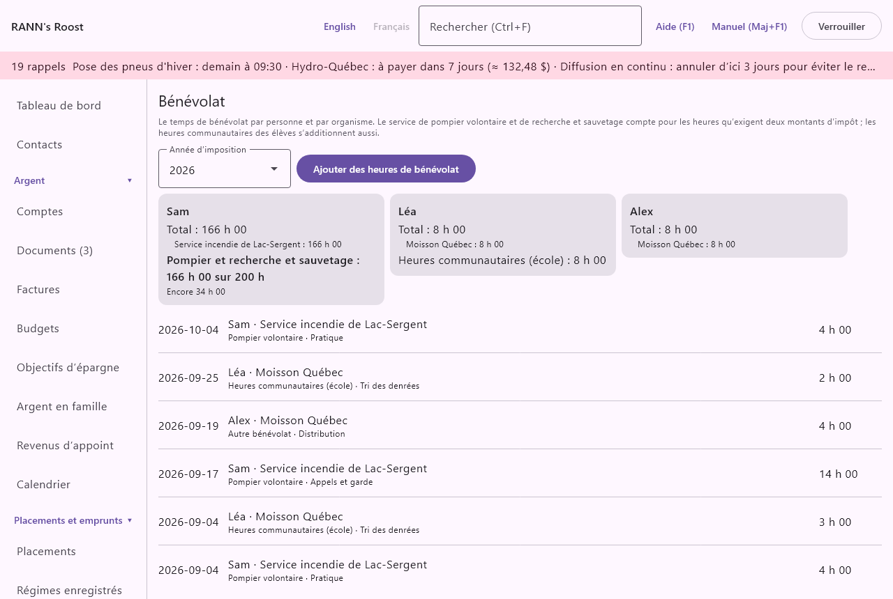

# Bénévolat

Bénévolat garde le temps que chaque personne donne à un organisme et l’additionne par année. Il compare les heures de pompier volontaire et de recherche et sauvetage aux 200 heures qu’exigent deux montants d’impôt, garde à part les heures communautaires des élèves et montre les totaux dans la trousse de fin d’année. L’écran se trouve dans le groupe **Maison et famille** du menu, sous **Bénévolat**.

@index: bénévolat; pompier volontaire; recherche et sauvetage; ligne 31220; ligne 31240; heures communautaires; engagement communautaire; volunteer

> Remarque : Le montant pour les pompiers volontaires (ligne 31220) et le montant pour les volontaires en recherche et sauvetage (ligne 31240) exigent au moins 200 heures de services bénévoles admissibles dans l’année ; les deux services comptent ensemble. D’autres conditions s’appliquent, comme des honoraires de plus de 1 000 $ pour le même service. RANN's Roost ne fait qu’additionner les heures et ne donne pas de conseils fiscaux.

## L’écran Bénévolat {#screen}

- **Année d’imposition** : l’année civile montrée, de cette année à six ans en arrière.
- **Ajouter des heures de bénévolat** : ouvre la [boîte](#dialog) pour de nouvelles heures.

Les nouvelles heures sont gardées avec les heures de bénévolat déjà inscrites pour la personne, pour que son année reste dans un même groupe de comptes ; les premières heures d’une personne vont dans votre groupe privé si vous en avez un, sinon dans le premier groupe partagé. Les heures envoyées du téléphone suivent la même règle, quel que soit le groupe où le téléphone envoie. Si vous pouvez modifier plusieurs groupes, la boîte permet toujours de choisir (**Enregistrer dans**). Ajouter des heures exige la permission d’ajouter des données dans ce groupe ; les modifier ou les supprimer exige la permission de modifier les données. **Ajouter des heures de bénévolat** est caché pour qui ne peut ajouter dans aucun groupe, et une ligne ne s’ouvre pas pour qui peut seulement consulter son groupe.

### Les cartes {#cards}

Une carte par personne ayant des heures dans l’année montre :

- **Total** : toutes les heures de la personne dans l’année, en heures et minutes (3 h 05).
- une ligne par organisme avec ses heures, du plus grand au plus petit.
- **Pompier et recherche et sauvetage** : les heures de **Pompier volontaire** et de **Recherche et sauvetage** ensemble, sur les 200 heures (**Heures de pompier volontaire et de recherche et sauvetage** dans [Taux et règles](rates-rules)), puis **Les 200 heures sont atteintes.** ou combien d’heures il reste.
- **Heures communautaires (école)** : les heures de ce genre, pour un élève qui doit faire un nombre d’heures pour obtenir son diplôme (40 heures en Ontario, par exemple).

### La liste {#list}

Les heures de l’année sont listées de la plus récente à la plus ancienne, sous les en-têtes **Date**, **Organisme** et **Durée** : la date, la personne et l’organisme, le genre, l’activité, **du téléphone** si elles en viennent, et la durée. Cliquez sur une ligne pour la modifier ou la supprimer.

## Boîte Ajouter des heures de bénévolat {#dialog}

- **Personne** : le membre du ménage qui a fait du bénévolat. Obligatoire.
- **Organisme** : obligatoire. Pendant la saisie, les organismes déjà utilisés sont proposés ; en choisir un ramène aussi son genre et son contact.
- **Contact** : un de vos [contacts](contacts) qui est un organisme, ou **Aucun**. En choisir un quand **Organisme** est vide inscrit son nom.
- **Genre** : **Pompier volontaire**, **Recherche et sauvetage**, **Heures communautaires (école)** ou **Autre bénévolat**. Seuls les deux premiers comptent pour les 200 heures.
- **Date** : le jour, comme 2026-10-05.
- **Durée (h:mm)** : en heures et minutes (1:30) ou en heures (1,5) ; de 1 minute à 24 heures. Une garde plus longue s’entre comme une ligne par jour.
- **Activité** et **Notes** : facultatifs.
- **Supprimer** : sur des heures existantes ; demande d’abord.

## Dans la trousse fiscale {#tax-package}

L’onglet **Trousse de fin d’année** de l’écran [Impôts](taxes#year-end-package) ajoute, dans les notes de la trousse d’une personne, ses heures de bénévolat de l’année et, si elle a des heures de pompier ou de recherche et sauvetage, si elles atteignent les 200 heures. C’est une information pour vous et votre préparateur ; aucun montant n’est ajouté.

## Sur le téléphone {#phone}

**Bénévolat** à l’onglet Capturer du téléphone envoie des heures pour une personne ; voyez [RANN's Roost Mobile](phone-app#log-forms).
