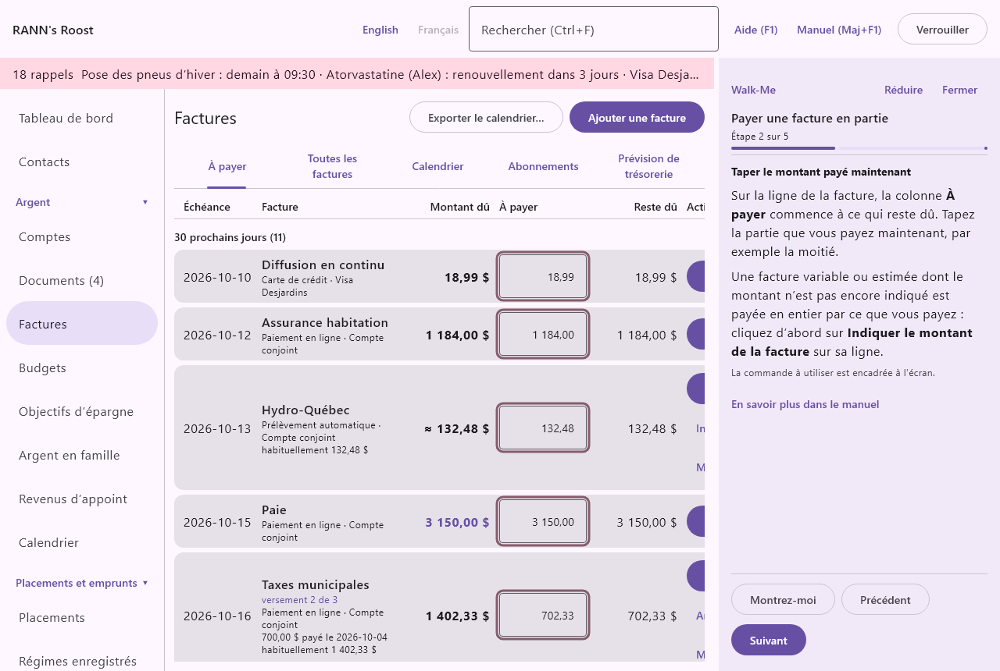

# Guides Walk-Me

Un guide Walk-Me vous accompagne dans une tâche courante, une étape à la fois, dans un panneau à droite de la fenêtre qui ne bloque jamais l’application. Chaque étape dit où aller, quoi choisir et quoi taper. **Montrez-moi** ouvre le bon écran, la commande à utiliser est encadrée à l’écran, et bien des étapes passent d’elles-mêmes à la suivante dès que l’application les voit faites. Il y a des guides pour mettre en place le ménage, les factures et les budgets, les documents et le téléphone, les emprunts et les placements, la maison et la famille, et les impôts et les rapports.

## Le menu Aide {#help-menu}

@index: menu Aide; Help menu; Walk-Me; guides; tutoriel; pas à pas

Le groupe Aide est le dernier groupe du menu : au bas de la liste de gauche ou, avec le menu en haut, le menu **Aide** à droite de la barre. Il contient :

- **Manuel (Maj+F1)** : ouvre ce manuel dans sa propre fenêtre, au chapitre de l’écran affiché.
- **Aide (F1)** : ouvre le court panneau d’aide au sujet de l’écran affiché. Voir [L’aide (F1) et le manuel](welcome#help-and-manual).
- **Guides Walk-Me** : la liste des guides (ci-dessous).
- **À propos** : la version, les mises à jour, les nouveautés, la confidentialité, la licence et le soutien. Voir [À propos](about).

Les boutons **Aide (F1)** et **Manuel (Maj+F1)** en haut de la fenêtre et les touches F1 et Maj+F1 fonctionnent comme avant, sur tous les écrans.

## L’écran Guides Walk-Me {#guides-screen}

@index: liste des guides; commencer un guide; reprendre un guide

Les guides sont regroupés : Pour commencer ; Factures et budgets ; Documents et téléphone ; Emprunts et placements ; Maison, famille et véhicules ; Impôts et rapports. Chaque guide montre son nom en gras, une ligne qui dit ce qu’il fait et son nombre d’étapes.

- **Commencer** : ouvre le guide à sa première étape.
- **Reprendre à l’étape** : affiché pour un guide fermé avant la fin ; il ouvre le guide là où vous l’avez laissé.
- **Recommencer** : à côté de **Reprendre à l’étape**, l’ouvre de nouveau à la première étape.
- « suivi jusqu’au bout » : affiché après le nombre d’étapes une fois qu’un guide a été terminé sur cet ordinateur.

Avant qu’un ménage soit ouvert, le bouton **Guides Walk-Me** de l’écran d’accueil montre la même liste, avec **Retour** pour revenir. Le premier guide, Créer votre ménage, commence là.

## Le panneau du guide {#panel}

@index: Montrez-moi; Suivant; Précédent; Terminer; Réduire; commande encadrée

Le panneau s’ouvre à droite de la fenêtre, à côté de l’écran affiché, et reste là pendant que vous passez d’un écran à l’autre. De haut en bas :

- **Walk-Me**, avec **Réduire** et **Fermer**.
- Le nom du guide, « Étape » et son numéro « sur » le nombre d’étapes, et une barre qui montre où vous en êtes.
- Le titre de l’étape et ce qu’il faut faire. Les libellés des boutons et des champs sont en gras, exactement comme à l’écran.
- « La commande à utiliser est encadrée à l’écran. » : affiché quand la commande dont parle l’étape est à l’écran. Elle est entourée d’un cadre de couleur qui pulse et amenée en vue.
- « Appuyez sur Montrez-moi pour ouvrir l’écran dont parle cette étape. » : affiché quand vous êtes ailleurs.
- « Cette étape passe d’elle-même à la suivante une fois faite. » : affiché pour une étape que l’application peut voir faite, comme une boîte de dialogue qui s’ouvre, un écran affiché ou un élément ajouté. Seul ce qui se passe pendant que l’étape est affichée compte : revenir à une étape ne la saute donc jamais.
- **En savoir plus dans le manuel** : ouvre le manuel à la section qui traite de cette étape.
- **Montrez-moi** : ouvre l’écran et l’onglet de l’étape. Il n’est affiché que pour une étape qui porte sur un écran : pas pour les étapes faites sur le téléphone ou dans une boîte de dialogue déjà ouverte, ni pour les étapes de l’écran d’accueil pendant qu’un ménage est ouvert.
- **Précédent** et **Suivant** : l’étape d’avant et l’étape d’après. À la dernière étape, **Terminer** ferme le guide.

Vous pouvez utiliser l’application normalement pendant que le panneau est ouvert : taper, cliquer, ouvrir des boîtes de dialogue. Faites glisser le bord gauche du panneau pour l’élargir ou le rétrécir ; la largeur est gardée sur cet ordinateur. **Réduire** en fait une mince bande qui montre le numéro de l’étape ; son bouton ◂ l’ouvre de nouveau.

Tout le panneau fonctionne au clavier : Tab passe à ses boutons et Entrée les active. Les lecteurs d’écran annoncent chaque nouvelle étape quand elle paraît, et le panneau comme une région nommée d’après le guide.

## Les étapes faites sur le téléphone {#phone-steps}

Jumeler un téléphone, saisir des reçus et des factures, enregistrer des déplacements et cocher la liste saisonnière se font sur le téléphone. L’ordinateur ne peut pas pointer l’écran du téléphone : ces étapes commencent donc par « Sur le téléphone » et disent en mots quoi toucher, avec les libellés du téléphone. Elles n’ont pas de **Montrez-moi** ; appuyez sur **Suivant** une fois qu’elles sont faites.

## La progression {#progress}

L’étape de chaque guide est gardée sur cet ordinateur, pour quiconque l’utilise : un guide fermé à mi-chemin s’ouvre à la même étape la fois suivante avec **Reprendre à l’étape**. Un guide suivi jusqu’au bout avec **Terminer** recommence au début. Rien des guides n’est gardé dans le ménage ni dans ses sauvegardes, et rien n’est envoyé nulle part.

## Les guides {#guide-list}

@index: liste des guides

Pour commencer :

- Créer votre ménage ; Institutions et comptes ; Membres et utilisateurs ; Importer un relevé ou un fichier Quicken ; Rapprocher un relevé ; Sauvegardes.

Factures et budgets :

- Factures ; Taxes foncières municipales ; Payer une facture en partie ; Budgets ; Objectifs d’épargne.

Documents et téléphone :

- Jumeler un téléphone ; Saisir et traiter un reçu ; Saisir et traiter une facture ; Détailler un reçu ; Lecture par IA.

Emprunts et placements :

- Hypothèques ; Prêts et marges de crédit ; Comptes de placement et titres détenus ; Régimes enregistrés.

Maison, famille et véhicules :

- Véhicules et entretien ; Déplacements avec le téléphone ; La liste saisonnière ; Services publics et compteurs ; Frais médicaux et réclamations ; Assurances ; Contacts ; Argent en famille et allocations.

Impôts et rapports :

- La trousse fiscale de fin d’année ; L’estimation de l’impôt sur le revenu ; Rapports personnalisés ; Le sommaire d’urgence et de succession.
